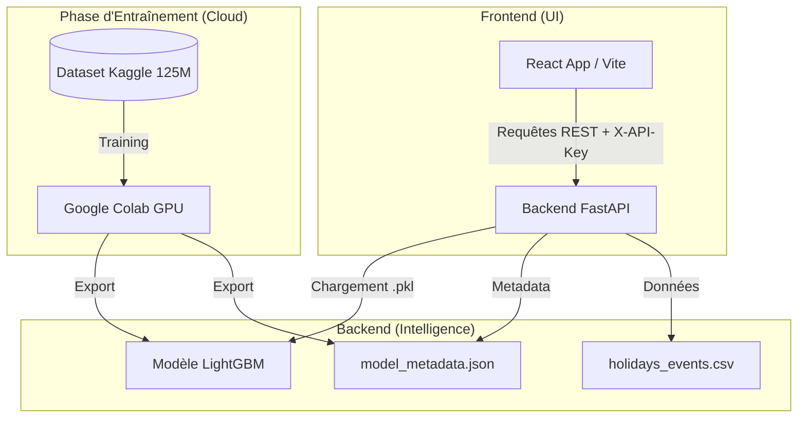

# 🛒 SmartRetail AI : Optimisation Intelligente des Stocks
**Systèmes d'Information (IA et Business Intelligence)**

Le projet **SmartRetail AI** est une solution de gestion de chaîne logistique assistée par Intelligence Artificielle. Il transforme un ERP traditionnel en un système proactif capable d'anticiper la demande future, d'optimiser les stocks et de prévenir les ruptures grâce à un moteur prédictif **LightGBM** entraîné sur le Big Data (125M+ lignes).

---

## 📊 Dataset : Corporación Favorita (Kaggle)
Le projet s'appuie sur le dataset de référence de la chaîne équatorienne **Corporación Favorita**.
- **Volume :** Plus de 125 millions d'enregistrements.
- **Entraînement :** Réalisé sur le dataset intégral via le Cloud (**Google Colab GPU**) avec optimisation Optuna pour une précision statistique maximale.
- **Lien :** [Favorita Grocery Sales Forecasting](https://www.kaggle.com/competitions/favorita-grocery-sales-forecasting)

---

## 🚀 Fonctionnalités SmartRetail_AI (4 Modules)
L'interface **React (Vite)** premium propose quatre modules métiers :
1.  **Dashboard :** Surveillance en temps réel des KPIs, ventes et alertes critiques.
2.  **Gestion des Stocks :** Suivi des niveaux de couverture et alertes intelligentes de rupture.
3.  **Prédictions IA :** Moteur d'inférence LightGBM pour simuler la demande et recommander des commandes.
4.  **Analytics (Benchmark) :** Visualisation scientifique du benchmark multi-modèles (14 métriques).

---

## 🛠️ Installation et Utilisation

### 1. Backend (FastAPI)
L'API sécurisée expose le modèle LightGBM et les endpoints métier.
```bash
# Installation des dépendances
pip install -r requirements.txt
# Lancement de l'API (Port 8000)
uvicorn api.main:app --reload
```
*Documentation Swagger disponible sur : `http://localhost:8000/docs`*

### 2. Frontend (React + Vite)
L'interface utilisateur moderne et réactive.
```bash
cd frontend
npm install
npm run dev
```
*Interface accessible sur : `http://localhost:5173`*

---

## 🔬 Benchmark Scientifique
Nous avons mené un benchmark exhaustif comparant 4 architectures sur des métriques d'erreur (MAE, RMSE, SMAPE) et opérationnelles (Stockout Rate, Overstock Rate).

| Modèle | R² | SMAPE (%) | Taux Rupture | Statut |
| :--- | :--- | :--- | :--- | :--- |
| **Baseline (Linear Reg)** | 0.42 | 68.21% | 52.1% | Référence |
| **XGBoost** | 0.51 | 54.80% | 43.2% | Performant |
| **LightGBM** | **0.59** | **48.32%** | **38.4%** | **Choisi ✓** |
| **LSTM** | 0.38 | 61.45% | 49.8% | Recherche |

---

## 🏢 Architecture du Système
Le projet repose sur une architecture en microservices séparant l'intelligence (IA) de l'interface utilisateur (UI), garantissant scalabilité et sécurité.



### Détails des Composants & Connexions

1.  **Frontend (React + Vite) :** 
    - Situé dans `/frontend`.
    - Communique avec le backend via des appels `fetch/axios` sécurisés.
    - Gère l'état global et les visualisations dynamiques (Recharts).

2.  **Backend (FastAPI) :**
    - Situé dans `/api/main.py`.
    - **Sécurité :** Vérifie le header `X-API-Key` pour chaque requête sensible.
    - **CORS :** Configuré pour accepter les requêtes provenant du domaine frontend.
    - **Inférence :** Charge le modèle LightGBM en mémoire au démarrage pour des prédictions ultra-rapides (<1ms).

3.  **Modèles & Artefacts :**
    - `models/lightgbm_full_model.pkl` : Le cerveau entraîné.
    - `models/model_metadata.json` : Contient les noms des colonnes et les hyperparamètres Optuna.

4.  **Connexions :**
    - **Frontend → Backend :** API REST (Port 8000).
    - **Backend → Models :** Chargement direct via `joblib`.
    - **Colab → Local :** Les modèles sont entraînés sur Colab puis téléchargés localement.

## 🧠 Logique Fonctionnelle

### 1. Moteur de Prédiction (IA)
L'API FastAPI (`/predict`) reçoit les données dynamiques du produit. Le processus d'inférence suit ces étapes :
- **Prétraitement :** Extraction des features temporelles (mois, jour de la semaine, weekend, jour férié).
- **Inférence :** Le modèle **LightGBM** calcule la demande attendue basée sur l'historique (`sales_lag_7`) et la tendance (`rolling_mean_7`).
- **Post-traitement :** Conversion du score flottant en unités entières positives.

### 2. Dashboard & Monitoring (BI)
L'interface React centralise les flux de données via l'endpoint `/kpis` :
- **Performance :** Affichage du taux de précision du modèle (R²) et des erreurs moyennes.
- **Visualisation :** Graphiques interactifs (Recharts) montrant les tendances de ventes historiques vs prédictions.
- **Réalisme :** Les données simulent un environnement de production avec des mises à jour en temps réel.

### 3. Gestion intelligente des Stocks (Alerting)
La logique métier est déportée dans l'algorithme d'alerte (`/alerts`) :
- **Comparaison :** Le système compare `Stock Physique` vs `Demande IA Prédite`.
- **Classification :**
    - **RUPTURE :** Si `Stock < Demande`.
    - **FLUX TENDU :** Si `Stock` est proche de la `Demande` (seuil de sécurité).
    - **SURSTOCK :** Si `Stock` dépasse largement la `Demande` (optimisation du fonds de roulement).
- **Notification :** Les alertes critiques sont immédiatement poussées vers le dashboard pour action immédiate.


---

## 👨‍🎓 Contexte Académique
Projet réalisé dans le cadre du Module IA pour la première année du Master SI. Il démontre l'industrialisation d'un modèle de Machine Learning (LightGBM) au sein d'une architecture logicielle moderne (React/FastAPI) pour résoudre une problématique critique de la grande distribution.
